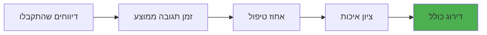
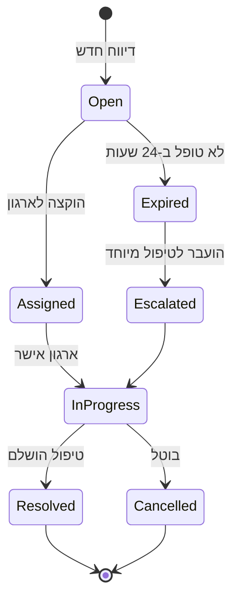

# מדריך למנהלי מערכת 👑

מדריך מקיף לניהול המערכת, הוספת ארגונים, ניהול משתמשים וניטור הפעילות.

## גישה ללוח הבקרה

### כתובת הגישה
```
https://your-domain.com/admin
```

### הרשאות נדרשות
- **Super Admin** - גישה מלאה לכל המערכת
- **Organization Admin** - ניהול ארגון ספציפי
- **Moderator** - צפייה ועריכה מוגבלת

## ניהול ארגונים 🏢

### הוספת ארגון חדש

#### שלב 1: איסוף פרטים

!!! info "שדות חובה"
    - שם הארגון
    - כתובת או מיקום GPS
    - לפחות ערוץ קשר אחד (טלפון/מייל/WhatsApp)

```python
# דוגמת נתוני ארגון
{
    "name": "עמותת צער בעלי חיים חיפה",
    "address": "רחוב הרצל 15, חיפה",
    "lat": 32.8191,
    "lon": 34.9983,
    "phone": "+972-4-8123456",
    "email": "info@animals-haifa.org",
    "whatsapp": "+972501234567",
    "website": "https://animals-haifa.org",
    "languages": ["he", "ar", "en"],
    "service_radius_km": 20,
    "active": true
}
```

#### שלב 2: אימות פרטים

##### אימות טלפון
```bash
# בדיקה דרך Twilio Lookup API
curl -X GET "https://lookups.twilio.com/v1/PhoneNumbers/+972501234567" \
     -u $TWILIO_ACCOUNT_SID:$TWILIO_AUTH_TOKEN
```

##### אימות מייל
- שליחת מייל אימות עם קוד
- בדיקת MX records
- אימות דומיין

##### אימות מיקום
```python
# אימות וגיאוקודינג
from app.services.geocoding import verify_location

location = await verify_location(
    address="רחוב הרצל 15, חיפה",
    lat=32.8191,
    lon=34.9983
)
```

#### שלב 3: הגדרת העדפות

| הגדרה | ערך ברירת מחדל | תיאור |
|--------|----------------|--------|
| ערוץ מועדף | WhatsApp | ערוץ ההתראה הראשי |
| שעות פעילות | 24/7 | מתי לשלוח התראות |
| שפות | עברית | שפות התקשורת |
| רדיוס פעילות | 15 ק"מ | טווח גיאוגרפי |
| קיבולת יומית | 10 | מספר דיווחים מקסימלי |
| זמן תגובה | 5 דקות | SLA לאישור ראשוני |

### ייבוא ארגונים בכמות (Bulk Import)

#### מקובץ CSV
```csv
name,address,phone,email,whatsapp,lat,lon,languages,radius_km
עמותת חיות הבר,רחוב הגפן 3 ירושלים,025123456,info@wildlife.org,+972501234567,31.7683,35.2137,"he,en",25
מקלט חיפה,שדרות בן גוריון 50 חיפה,048234567,haifa@shelter.org,+972502345678,32.8191,34.9983,"he,ar",20
```

```bash
# ייבוא דרך סקריפט
python scripts/import_organizations.py --file organizations.csv --validate
```

#### מ-Google Places
```python
# סקריפט איסוף אוטומטי
from app.services.google import collect_veterinarians

orgs = await collect_veterinarians(
    location="תל אביב",
    radius_km=30,
    language="he"
)

for org in orgs:
    await create_organization(org)
```

### ניהול סטטוס ארגונים

#### סטטוסים אפשריים
- **🟢 Active** - פעיל ומקבל התראות
- **🟡 Paused** - מושהה זמנית
- **🔴 Inactive** - לא פעיל
- **⚫ Blacklisted** - חסום

#### שינוי סטטוס
```python
# השהיה זמנית
await update_organization(
    org_id="123",
    status="paused",
    pause_until="2025-02-01",
    reason="חופשה שנתית"
)
```

### ניטור ביצועי ארגונים



#### מדדי ביצוע
| מדד | חישוב | משקל |
|-----|--------|-------|
| זמן תגובה | ממוצע זמן עד אישור | 30% |
| שיעור טיפול | דיווחים שטופלו / סה"כ | 40% |
| משוב משתמשים | ציון ממוצע 1-5 | 20% |
| זמינות | שעות פעילות / 24 | 10% |

## ניהול דיווחים 📋

### מסך דיווחים ראשי

```
┌─────────────────────────────────────────────────────┐
│ 🔍 חיפוש: [_______________] [🔽 סטטוס] [📅 תאריך] │
├─────────────────────────────────────────────────────┤
│ ID    │ תאריך    │ מיקום    │ סוג    │ סטטוס    │
│ #1234 │ 15/01/25 │ חיפה     │ כלב    │ 🟢 פתוח  │
│ #1233 │ 15/01/25 │ ת"א      │ חתול   │ 🟡 בטיפול │
│ #1232 │ 14/01/25 │ ירושלים  │ ציפור  │ ✅ טופל   │
└─────────────────────────────────────────────────────┘
```

### סטטוסי דיווח



### פעולות על דיווחים

#### הקצאה ידנית
```python
# הקצאת דיווח לארגון ספציפי
await assign_report(
    report_id="report_123",
    organization_id="org_456",
    priority="high",
    notes="דחוף - בעל חיים פצוע"
)
```

#### שינוי סטטוס
```python
# סגירת דיווח
await update_report_status(
    report_id="report_123",
    status="resolved",
    resolution="הכלב חולץ והועבר לטיפול וטרינרי",
    resolved_by="org_456"
)
```

#### הסלמה
```python
# הסלמת דיווח שלא טופל
await escalate_report(
    report_id="report_123",
    escalation_level=2,
    notify_managers=True,
    expand_radius=True  # הרחבת רדיוס החיפוש
)
```

## ניהול משתמשים 👥

### סוגי משתמשים

| תפקיד | הרשאות | תיאור |
|-------|---------|-------|
| **Reporter** | יצירת דיווחים | משתמש רגיל |
| **Volunteer** | צפייה בדיווחים באזור | מתנדב |
| **Org Staff** | ניהול דיווחי הארגון | צוות ארגון |
| **Org Admin** | ניהול מלא של הארגון | מנהל ארגון |
| **Moderator** | עריכת כל הדיווחים | מנהל תוכן |
| **Admin** | גישה מלאה | מנהל מערכת |

### הוספת משתמש חדש

```python
# יצירת משתמש
user = await create_user({
    "telegram_id": 123456789,
    "username": "john_doe",
    "full_name": "John Doe",
    "phone": "+972501234567",
    "email": "john@example.com",
    "role": "volunteer",
    "organization_id": "org_123",  # אופציונלי
    "languages": ["he", "en"]
})
```

### ניהול הרשאות

```python
# שינוי תפקיד
await update_user_role(
    user_id="user_123",
    new_role="org_admin",
    organization_id="org_456"
)

# הוספת הרשאה ספציפית
await grant_permission(
    user_id="user_123",
    permission="view_all_reports",
    scope="region:north"
)
```

## הגדרות התראות 🔔

### ערוצי התראה

#### WhatsApp (מועדף)
```python
WHATSAPP_CONFIG = {
    "provider": "twilio",
    "from_number": "whatsapp:+14155238886",
    "templates": {
        "new_report": "דיווח חדש #{id}: {description}",
        "urgent": "🚨 דחוף! {animal_type} ב{location}"
    },
    "rate_limit": "100/hour"
}
```

#### SMS
```python
SMS_CONFIG = {
    "provider": "twilio",
    "from_number": "+972501234567",
    "max_length": 160,
    "unicode": True,
    "fallback": True  # משמש כ-fallback ל-WhatsApp
}
```

#### Email
```python
EMAIL_CONFIG = {
    "smtp_host": "smtp.gmail.com",
    "smtp_port": 587,
    "from_address": "alerts@animal-rescue.org",
    "templates_dir": "app/templates/emails/",
    "attach_images": True
}
```

### מדיניות התראות

```python
NOTIFICATION_POLICY = {
    "max_attempts": 3,
    "retry_intervals": [2, 5, 10],  # דקות
    "escalation_levels": [
        {"channels": ["whatsapp"], "radius": 10},
        {"channels": ["whatsapp", "sms"], "radius": 20},
        {"channels": ["whatsapp", "sms", "email"], "radius": 30},
        {"channels": ["voice"], "radius": 50}
    ],
    "quiet_hours": {
        "start": "22:00",
        "end": "07:00",
        "override_urgency": "critical"  # רק דחוף מאוד
    }
}
```

## ניטור ודוחות 📊

### Dashboard ראשי

```
┌──────────────────────────────────────────────────┐
│              📊 סטטיסטיקות יומיות              │
├──────────────────────────────────────────────────┤
│ דיווחים חדשים: 45  │  בטיפול: 23  │  טופלו: 67 │
│ זמן תגובה ממוצע: 3.2 דקות │ שיעור הצלחה: 89%  │
└──────────────────────────────────────────────────┘

📈 גרף דיווחים לפי שעה
[████████▓▓▓▓░░░░░░░░░░░░]

🗺️ מפת חום - ריכוז דיווחים
[מפה אינטראקטיבית עם נקודות חמות]

🏆 ארגונים מובילים
1. עמותת חיפה - 45 טיפולים
2. מקלט ת"א - 38 טיפולים
3. וטרינר ירושלים - 29 טיפולים
```

### דוחות תקופתיים

#### דוח יומי
```python
daily_report = await generate_daily_report(date="2025-01-15")
# כולל:
# - סיכום דיווחים
# - ביצועי ארגונים
# - תקלות ובעיות
# - המלצות לשיפור
```

#### דוח חודשי
```python
monthly_report = await generate_monthly_report(
    month="2025-01",
    include_trends=True,
    include_predictions=True
)
```

### התראות מערכת

| סוג התראה | תנאי הפעלה | ערוץ |
|-----------|------------|-------|
| 🔴 קריטי | שירות נפל | SMS + Email |
| 🟡 אזהרה | עומס גבוה (>80%) | Email |
| 🔵 מידע | גיבוי הושלם | Dashboard |
| 🟢 הצלחה | ארגון חדש נוסף | Dashboard |

## תקלות נפוצות ופתרונות 🔧

### בעיה: ארגון לא מקבל התראות

**בדיקות:**
1. ✅ סטטוס ארגון = Active
2. ✅ ערוצי קשר מאומתים
3. ✅ שעות פעילות תקינות
4. ✅ לא חרג מ-rate limit
5. ✅ אין חסימה ב-blacklist

**פתרון:**
```bash
# בדיקת סטטוס ארגון
python manage.py check_org_status --id org_123

# איפוס ערוץ התראות
python manage.py reset_notifications --org org_123 --channel whatsapp
```

### בעיה: דיווחים לא מעובדים

**בדיקות:**
```python
# בדיקת Workers
await check_worker_status()

# בדיקת תור משימות
await check_queue_health()

# בדיקת שירותים חיצוניים
await check_external_services()
```

**פתרון:**
```bash
# הפעלה מחדש של Workers
supervisorctl restart workers:*

# ניקוי תור תקוע
rq empty failed --queue alerts
```

### בעיה: ביצועים איטיים

**אופטימיזציה:**
```sql
-- אינדקסים חסרים
EXPLAIN ANALYZE SELECT * FROM reports WHERE status = 'open';

-- ניקוי DB
VACUUM ANALYZE reports;

-- בדיקת locks
SELECT * FROM pg_locks WHERE NOT granted;
```

## אבטחה ובקרה 🔐

### ניהול גישות

```python
# הגדרת מדיניות סיסמאות
PASSWORD_POLICY = {
    "min_length": 12,
    "require_uppercase": True,
    "require_lowercase": True,
    "require_numbers": True,
    "require_special": True,
    "max_age_days": 90,
    "history_count": 5
}

# הפעלת 2FA
await enable_2fa(user_id="user_123", method="totp")
```

### Audit Log

```python
# כל פעולה נרשמת
{
    "timestamp": "2025-01-15T10:30:00Z",
    "user_id": "admin_123",
    "action": "UPDATE_ORGANIZATION",
    "resource": "org_456",
    "changes": {
        "status": {"old": "active", "new": "paused"}
    },
    "ip_address": "192.168.1.1",
    "user_agent": "Mozilla/5.0..."
}
```

### גיבויים

```bash
# גיבוי יומי אוטומטי
0 2 * * * /scripts/backup.sh

# גיבוי ידני
python manage.py backup --full --encrypt --upload-s3
```

## כלי ניהול CLI

### פקודות שימושיות

```bash
# ניהול ארגונים
python manage.py org list --status active
python manage.py org add --file org_data.json
python manage.py org update --id org_123 --status paused

# ניהול דיווחים
python manage.py reports stats --date today
python manage.py reports cleanup --older-than 30d
python manage.py reports export --format csv --output reports.csv

# ניהול משתמשים
python manage.py user create --role admin
python manage.py user reset-password --email user@example.com
python manage.py user deactivate --id user_123

# תחזוקה
python manage.py db optimize
python manage.py cache clear
python manage.py logs rotate
```

## אינטגרציות 🔗

### Webhook לשירותים חיצוניים

```python
# הגדרת webhook
await create_webhook({
    "url": "https://external-service.com/webhook",
    "events": ["report.created", "report.resolved"],
    "secret": "webhook_secret_123",
    "active": True
})
```

### API Keys לגישה חיצונית

```python
# יצירת API key
api_key = await generate_api_key({
    "name": "Mobile App",
    "permissions": ["read:reports", "create:reports"],
    "rate_limit": "1000/hour",
    "expires_at": "2025-12-31"
})
```

## צ'קליסט יומי למנהל

- [ ] בדיקת health status - כל השירותים ירוקים
- [ ] סקירת דיווחים פתוחים - אין דיווחים תקועים
- [ ] בדיקת התראות שנכשלו - טיפול בבעיות
- [ ] ניטור ביצועים - זמני תגובה תקינים
- [ ] סקירת לוגים - אין שגיאות קריטיות
- [ ] בדיקת גיבויים - גיבוי הלילה הצליח
- [ ] עדכון ארגונים - אימות פרטי קשר
- [ ] מענה לפניות - תמיכה למשתמשים

---

<div align="center">
  <strong>💡 טיפ: השתמש בקיצורי מקלדת בלוח הבקרה</strong>
  <br>
  <code>Ctrl+K</code> - חיפוש מהיר | <code>Ctrl+N</code> - דיווח חדש | <code>Ctrl+S</code> - שמירה
</div>