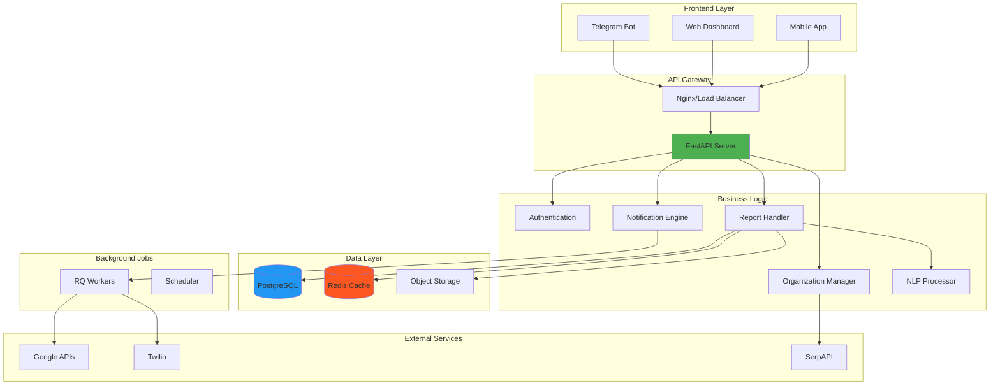
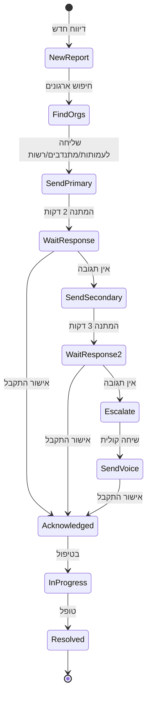
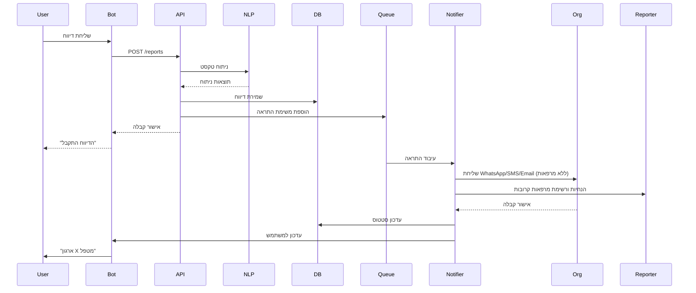
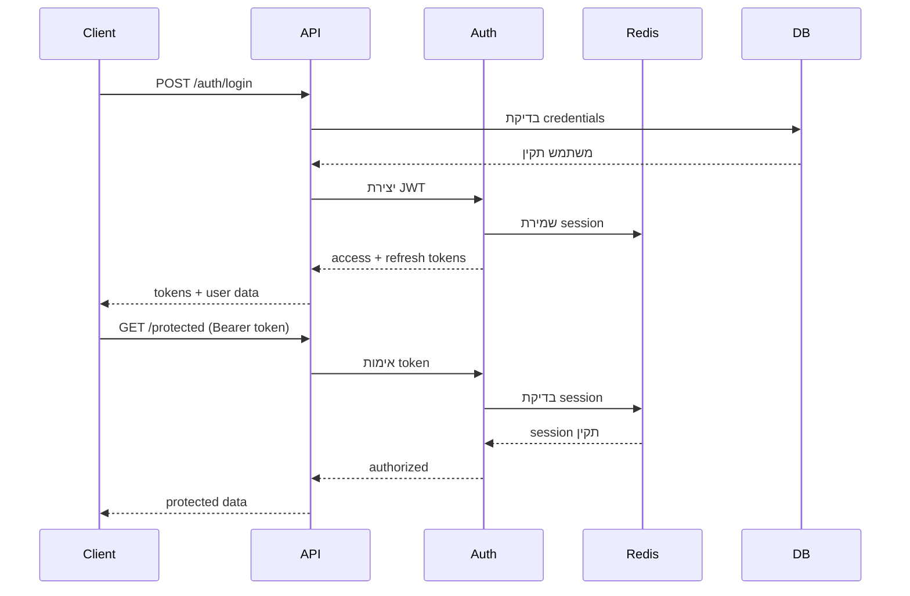
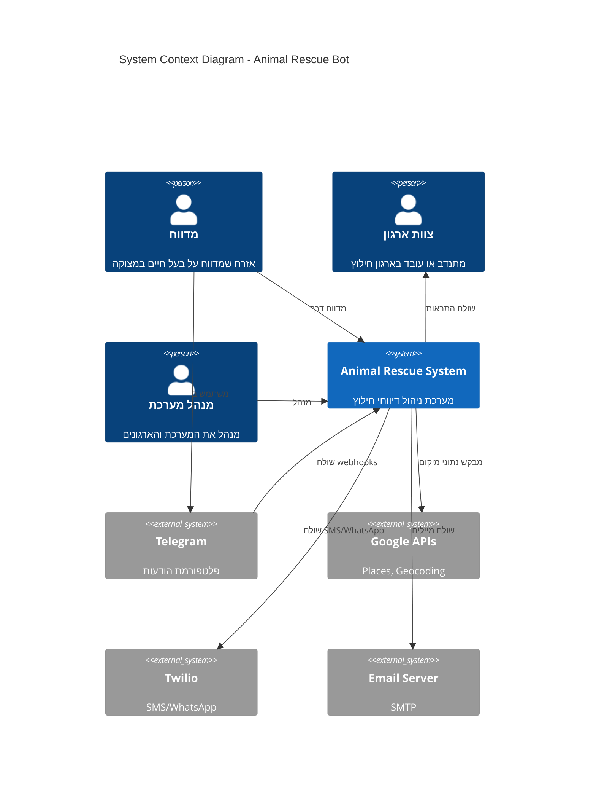

# ארכיטקטורת המערכת 🏗️

## סקירה כללית

המערכת בנויה בארכיטקטורת **מיקרו-שירותים מודולרית** עם הפרדה ברורה בין רכיבים. הארכיטקטורה מאפשרת סקיילינג אופקי, תחזוקה קלה והרחבה גמישה.

## רכיבי ליבה



## שכבות המערכת

### 1. שכבת הממשק (Frontend Layer)

#### בוט טלגרם
- **טכנולוגיה**: python-telegram-bot 22.4+
- **תקשורת**: Webhook מאובטח עם secret token
- **תכונות**:
  - תמיכה בפקודות (/start, /new_report, /help)
  - ניהול מצב שיחה (ConversationHandler)
  - תמיכה במדיה (תמונות, מיקום, קבצים)
  - כפתורים אינטראקטיביים (InlineKeyboard)

#### לוח בקרה (Admin Dashboard)
- **טכנולוגיה**: Jinja2 Templates + HTMX
- **אימות**: JWT Tokens
- **תכונות**:
  - ניהול משתמשים וארגונים
  - צפייה בדיווחים בזמן אמת
  - סטטיסטיקות ואנליטיקה
  - הגדרות מערכת

### 2. שכבת ה-API

#### FastAPI Server
- **גרסה**: FastAPI 0.115+
- **תכונות**:
  - Async/await native
  - OpenAPI documentation אוטומטי
  - Type hints ו-Pydantic validation
  - Middleware לאימות ו-CORS

#### נקודות קצה עיקריות

```python
# דיווחים
POST   /api/v1/reports/           # יצירת דיווח חדש
GET    /api/v1/reports/{id}       # קבלת דיווח
PATCH  /api/v1/reports/{id}       # עדכון סטטוס
GET    /api/v1/reports/           # רשימת דיווחים

# ארגונים
GET    /api/v1/organizations/     # רשימת ארגונים
POST   /api/v1/organizations/     # הוספת ארגון
PATCH  /api/v1/organizations/{id} # עדכון פרטים

# משתמשים
POST   /api/v1/auth/login         # התחברות
POST   /api/v1/auth/refresh       # רענון טוקן
GET    /api/v1/users/me           # פרטי משתמש

# מערכת
GET    /health                    # בדיקת בריאות
GET    /metrics                   # מטריקות
```

### 3. לוגיקה עסקית

#### מנוע עיבוד דיווחים
```python
class ReportProcessor:
    async def process_report(self, report_data):
        # 1. אימות נתונים
        validated = await self.validate(report_data)
        
        # 2. העשרת נתונים
        enriched = await self.enrich_data(validated)
        
        # 3. ניתוח NLP
        analyzed = await self.nlp_analyze(enriched)
        
        # 4. התאמת ארגונים
        matched_orgs = await self.match_organizations(analyzed)
        
        # 5. שליחת התראות
        # התראות נשלחות לעמותות/מקלטים/קבוצות מתנדבים/רשות בלבד; מרפאות אינן מקבלות התראות
        await self.send_notifications(matched_orgs, analyzed)
        # 6. הודעת הנחיות למדווח + רשימת מרפאות קרובות להגעה עצמאית
        await self.notify_reporter_with_guidance(analyzed)
        
        # 6. שמירה ב-DB
        return await self.save_report(analyzed)
```

#### מערכת התראות מדורגת



### 4. שכבת הנתונים

#### PostgreSQL + PostGIS
- **סכימה עיקרית**:
  - `users` - משתמשי מערכת
  - `organizations` - ארגוני חילוץ
  - `reports` - דיווחים
  - `notifications` - התראות שנשלחו
  - `audit_logs` - לוג פעולות

#### Redis
- **שימושים**:
  - Session storage
  - Rate limiting
  - Caching (TTL 5-60 דקות)
  - Job queues (RQ)
  - Real-time counters

#### אחסון אובייקטים (S3/R2)
- תמונות דיווחים
- קבצים מצורפים
- גיבויים

### 5. עיבוד ברקע

#### RQ Workers
```python
# תורים
QUEUES = {
    'default': 'משימות כלליות',
    'alerts': 'שליחת התראות',
    'maintenance': 'תחזוקה וניקוי',
    'external': 'קריאות ל-APIs חיצוניים'
}

# דוגמת משימה
@job('alerts', timeout=300)
async def send_notification(org_id, report_id, channel):
    org = await get_organization(org_id)
    report = await get_report(report_id)
    
    if channel == 'whatsapp':
        await send_whatsapp(org.phone, report)
    elif channel == 'email':
        await send_email(org.email, report)
    elif channel == 'sms':
        await send_sms(org.phone, report)
```

#### Scheduler
- ניקוי נתונים ישנים
- סנכרון ארגונים
- יצירת דוחות
- בדיקות בריאות

## זרימות נתונים מרכזיות

### זרימת דיווח חדש



### זרימת אימות



## אינטגרציות חיצוניות

### Google APIs

#### Places API
```python
# חיפוש מקומות
places_client.find_place(
    input="וטרינר חיפה",
    input_type="textquery",
    fields=["place_id", "name", "geometry", "formatted_phone_number"]
)

# פרטי מקום
places_client.place(
    place_id="ChIJN1t_tDeuEmsRUsoyG83frY4",
    fields=["name", "formatted_phone_number", "website", "opening_hours"]
)
```

#### Geocoding API
```python
# המרת כתובת למיקום
geocoding_client.geocode("רחוב הרצל 1, תל אביב")

# המרת מיקום לכתובת
geocoding_client.reverse_geocode((32.0853, 34.7818))
```

### Twilio

#### SMS
```python
client.messages.create(
    body="דיווח חדש: כלב פצוע ברחוב הרצל",
    from_=TWILIO_PHONE,
    to="+972501234567"
)
```

#### WhatsApp
```python
client.messages.create(
    body="דיווח חדש מחייב טיפול דחוף",
    from_="whatsapp:+14155238886",
    to="whatsapp:+972501234567",
    media_url=["https://example.com/image.jpg"]
)
```

## ביצועים וסקיילינג

### אסטרטגיית Caching

| נתון | TTL | מפתח |
|------|-----|-------|
| רשימת ארגונים | 1 שעה | `orgs:{region}:{page}` |
| פרטי ארגון | 30 דקות | `org:{id}` |
| סטטיסטיקות | 5 דקות | `stats:{type}:{date}` |
| תוצאות NLP | 24 שעות | `nlp:{text_hash}` |
| Geocoding | 7 ימים | `geo:{address_hash}` |

### Database Optimization

```sql
-- אינדקסים קריטיים
CREATE INDEX idx_reports_status ON reports(status);
CREATE INDEX idx_reports_created ON reports(created_at DESC);
CREATE INDEX idx_orgs_location ON organizations USING GIST(location);
CREATE INDEX idx_notifications_sent ON notifications(sent_at, status);

-- Partitioning לטבלאות גדולות
CREATE TABLE reports_2024 PARTITION OF reports
FOR VALUES FROM ('2024-01-01') TO ('2025-01-01');
```

### הגדרות Connection Pool

```python
# PostgreSQL
SQLALCHEMY_POOL_SIZE = 20
SQLALCHEMY_MAX_OVERFLOW = 40
SQLALCHEMY_POOL_TIMEOUT = 30

# Redis
REDIS_MAX_CONNECTIONS = 100
REDIS_CONNECTION_TIMEOUT = 5
```

## אבטחה

### הצפנה
- HTTPS בכל התקשורת
- הצפנת passwords עם bcrypt
- JWT tokens עם RS256
- הצפנת נתונים רגישים ב-DB

### Rate Limiting
```python
RATE_LIMITS = {
    "api": "100/minute",
    "auth": "5/minute",
    "reports": "10/minute/user",
    "webhook": "1000/minute"
}
```

### Validation & Sanitization
- Pydantic models לכל ה-input
- SQL injection prevention עם ORM
- XSS prevention ב-templates
- File upload validation

## ניטור ולוגים

### Health Checks
```python
@app.get("/health")
async def health_check():
    checks = {
        "database": await check_database(),
        "redis": await check_redis(),
        "telegram": await check_telegram(),
        "google_api": await check_google_api(),
    }
    
    status = "healthy" if all(checks.values()) else "degraded"
    return {"status": status, "checks": checks}
```

### Metrics (Prometheus format)
```
# TYPE http_requests_total counter
http_requests_total{method="GET",endpoint="/api/v1/reports",status="200"} 1234

# TYPE http_request_duration_seconds histogram
http_request_duration_seconds_bucket{le="0.1"} 8123
http_request_duration_seconds_bucket{le="0.5"} 9843

# TYPE active_reports gauge
active_reports{status="open"} 23
active_reports{status="in_progress"} 12
```

### Structured Logging
```json
{
  "timestamp": "2025-01-15T10:23:45Z",
  "level": "INFO",
  "service": "api",
  "trace_id": "abc123",
  "user_id": "user_456",
  "message": "Report created successfully",
  "extra": {
    "report_id": "report_789",
    "location": [32.0853, 34.7818],
    "urgency": "high"
  }
}
```

## תרשים רכיבים מפורט



## המשך פיתוח

### Roadmap
1. **Phase 1** (הושלם): MVP בסיסי עם בוט וניהול דיווחים
2. **Phase 2** (נוכחי): מערכת התראות מתקדמת ולוח בקרה
3. **Phase 3**: אפליקציית מובייל native
4. **Phase 4**: AI לזיהוי תמונות וסיווג אוטומטי
5. **Phase 5**: פלטפורמה בינלאומית רב-שפתית

### הרחבות אפשריות
- WebSocket לעדכונים בזמן אמת
- GraphQL API
- Machine Learning לחיזוי דחיפות
- Blockchain לשקיפות דיווחים
- IoT integration (GPS trackers)

---

<div align="center">
  <strong>📚 למידע נוסף ראה [מדריך הפיתוח](dev-guide.md)</strong>
</div>