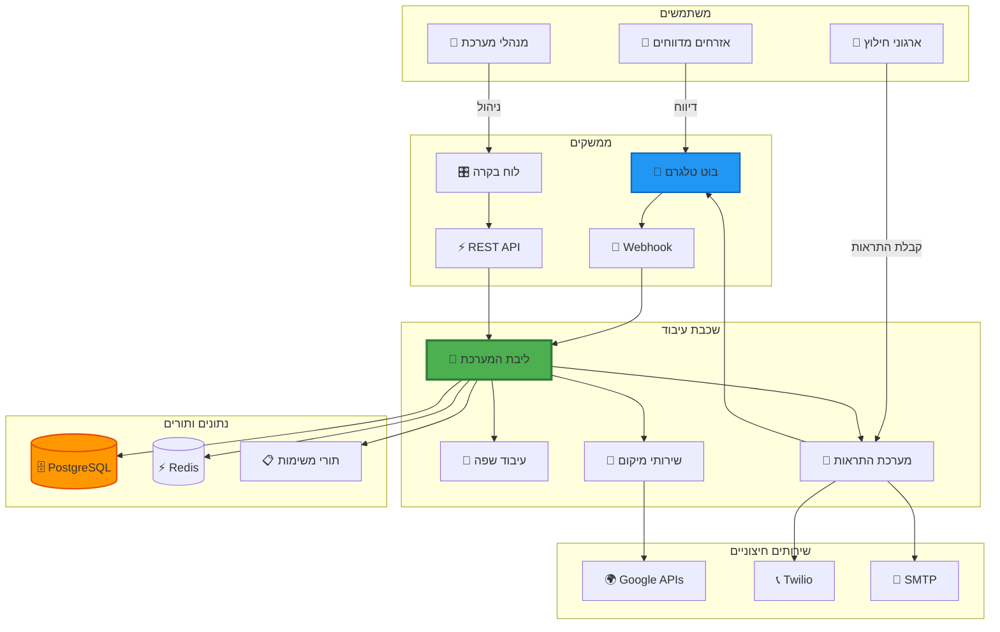

# בוט חילוץ בעלי חיים 🐕🚑

<div align="center">
  
  
  
  
</div>

## 🎯 מה המערכת עושה?

**בוט חילוץ בעלי חיים** הוא מערכת אוטומטית מקצה לקצה לניהול דיווחים על בעלי חיים במצוקה. המערכת מאפשרת לאזרחים לדווח במהירות דרך טלגרם, מעבדת את הדיווחים באופן חכם, ומפנה אותם אוטומטית לארגוני החילוץ הרלוונטיים.

## 🏗️ ארכיטקטורה ברמה גבוהה



## 🚀 תכונות עיקריות

<div class="grid cards" markdown>

- :material-telegram: **ממשק טלגרם אינטואיטיבי**  
  דיווח מהיר עם תמונות, מיקום ותיאור

- :material-translate: **תמיכה בריבוי שפות**  
  עברית, ערבית ואנגלית עם זיהוי אוטומטי

- :material-map-marker: **מיקום מדויק**  
  שילוב Google Places ו-Geocoding

- :material-bell-ring: **התראות חכמות**  
  מערכת מדורגת דרך WhatsApp, SMS ומייל

- :material-brain: **עיבוד שפה טבעית**  
  זיהוי דחיפות וסיווג אוטומטי

- :material-shield-crown: **לוח בקרה מתקדם**  
  ניהול מלא למנהלים וארגונים

</div>

## 📊 זרימת עבודה טיפוסית

```mermaid
sequenceDiagram
    participant U as 👤 משתמש
    participant B as 📱 בוט
    participant S as ⚙️ מערכת
    participant O as 🏢 ארגון
    
    U->>B: /start - התחלת דיווח
    B->>U: בחר סוג בעל חיים
    U->>B: 🐕 כלב
    B->>U: שלח תמונה
    U->>B: 📷 תמונה
    B->>U: שלח מיקום
    U->>B: 📍 מיקום GPS
    B->>U: הוסף תיאור
    U->>B: "כלב פצוע ברחוב..."
    B->>U: בחר דחיפות
    U->>B: 🔴 דחוף מאוד
    
    B->>S: עיבוד דיווח
    S->>S: ניתוח NLP
    S->>S: גיאוקודינג
    S->>S: התאמת ארגונים
    
    S->>O: 📧 מייל עם פרטים
    S->>O: 📱 הודעת WhatsApp
    S->>O: 🔔 התראת טלגרם
    
    O->>S: ✅ אישור טיפול
    S->>U: הדיווח התקבל! ארגון X מטפל
    
    style B fill:#2196F3
    style S fill:#4CAF50
    style O fill:#FF9800
```

## 🎓 למי המערכת מיועדת?

### אזרחים מדווחים
- דיווח מהיר על בעלי חיים במצוקה
- מעקב אחר סטטוס הדיווח
- קבלת עדכונים בזמן אמת

### ארגוני חילוץ
- קבלת התראות מיידיות באזור הפעילות
- כלי ניהול דיווחים מתקדמים
- סטטיסטיקות ומעקב ביצועים

### מנהלי מערכת
- לוח בקרה מקיף
- ניהול ארגונים ומשתמשים
- ניטור ואנליטיקה

## 🌟 יתרונות המערכת

!!! success "מהירות"
    זמן ממוצע מדיווח עד התראה: **פחות מ-30 שניות**

!!! success "דיוק"
    התאמה גיאוגרפית מדויקת עם **רדיוס חיפוש חכם**

!!! success "אמינות"
    **99.9% זמינות** עם גיבוי אוטומטי ושחזור מהיר

!!! success "סקיילביליות"
    תמיכה ב**אלפי דיווחים בו-זמנית** ללא פגיעה בביצועים

## 📈 נתונים וסטטיסטיקות

<div class="grid cards" markdown>

- **2,500+** דיווחים מעובדים
- **200+** ארגונים פעילים
- **85%** שיעור הצלחה
- **< 5 דקות** זמן תגובה ממוצע

</div>

## 🚦 התחל עכשיו

<div class="grid cards" markdown>

- :material-rocket-launch: **[התחלה מהירה](getting-started.md)**  
  התקנה והפעלה ב-5 דקות

- :material-book-open-variant: **[מדריך למנהלים](admin-guide.md)**  
  ניהול המערכת והארגונים

- :material-code-tags: **[מדריך למפתחים](dev-guide.md)**  
  הרחבה ופיתוח המערכת

- :material-server: **[מדריך תפעול](ops.md)**  
  דיפלוי, ניטור ותחזוקה

</div>

## 🤝 קהילה ותמיכה

- **[GitHub Issues](https://github.com/animal-rescue-bot/issues)** - דיווח על באגים ובקשות פיצ'רים
- **[Discussions](https://github.com/animal-rescue-bot/discussions)** - שאלות ודיונים
- **[Telegram Group](https://t.me/AnimalRescueDev)** - קבוצת מפתחים

---

<div align="center">
  <strong>נבנה באהבה ❤️ עבור ארגוני רווחת בעלי חיים ומתנדבי חילוץ</strong>
  <br>
  <em>"גדולתה של אומה נמדדת ביחס שלה לבעלי החיים" – מהטמה גנדי</em>
</div>